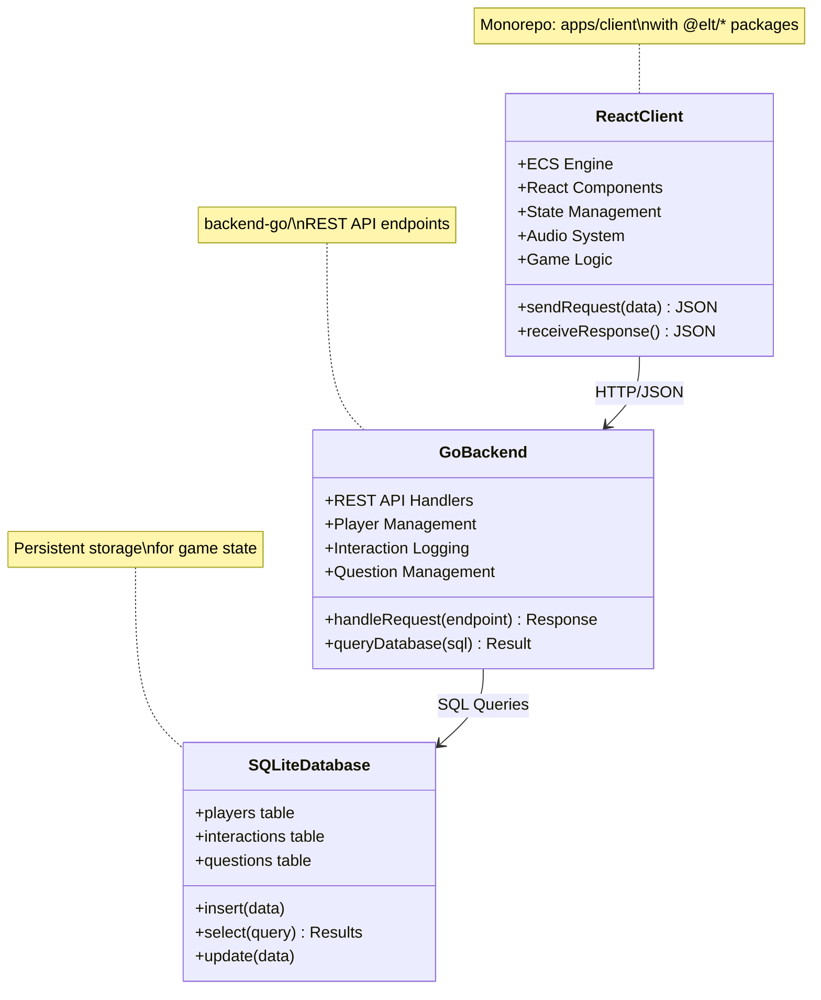
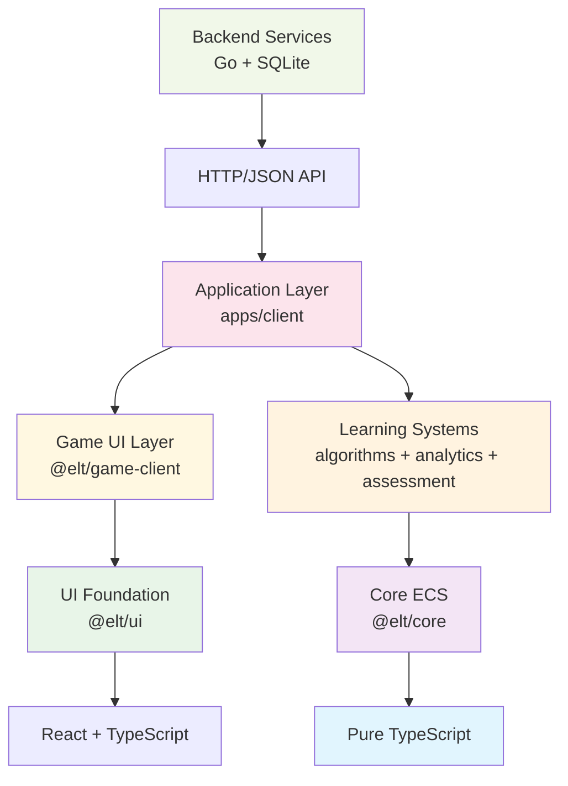
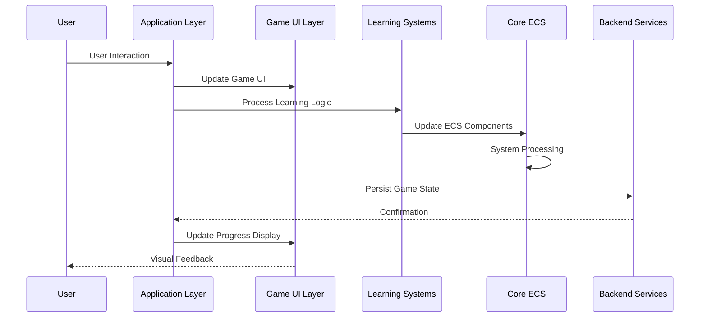
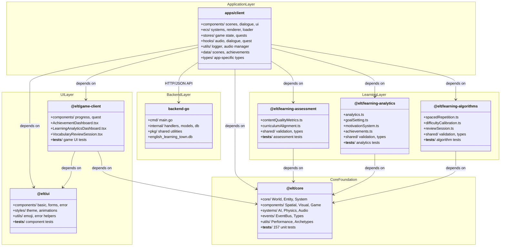

# Technical Architecture & Patterns

## 🏗️ System Overview

English Learning Town is built using modern **ECS (Entity Component System) architecture** with **React + TypeScript** in a **monorepo structure**, providing a scalable, maintainable foundation for educational gaming.

### 🏗️ Monorepo Architecture (2025-01-17)

```
english-learning-town/
├── apps/
│   └── client/                 # Main React application
├── packages/
│   ├── core/                   # @elt/core - ECS engine (157 tests)
│   ├── ui/                     # @elt/ui - Reusable React components
│   ├── game-client/            # @elt/game-client - Game-specific UI
│   ├── learning-algorithms/    # @elt/learning-algorithms - Educational algorithms
│   ├── learning-analytics/     # @elt/learning-analytics - Progress tracking
│   └── learning-assessment/    # @elt/learning-assessment - Content quality
├── backend-go/                 # Go REST API and database
├── docs/                       # mdBook documentation
├── pnpm-workspace.yaml         # Workspace configuration
├── turbo.json                  # Build system configuration
└── tsconfig.base.json          # Shared TypeScript config
```



## 🏗️ Layered Architecture (Bottom to Top)

The system follows a clean layered architecture where each layer depends only on layers below it, ensuring clear separation of concerns and maintainable dependencies.

### Layer 1: Core Foundation (`@elt/core`)

**Foundation ECS Engine - Zero Dependencies**

- **Purpose**: Pure ECS engine implementation with no external dependencies
- **Components**: World, Entity, Component, System base classes
- **Features**: Event bus, component management, system orchestration
- **Technologies**: Pure TypeScript, 157 comprehensive unit tests
- **Dependencies**: None (foundation layer)

```typescript
// Core ECS functionality
import { World, createPositionComponent, MovementSystem } from "@elt/core";
```

### Layer 2: Specialized Learning Systems

**Domain-Specific Learning Algorithms**

#### `@elt/learning-algorithms`

- **Purpose**: Educational algorithms and learning mechanics
- **Features**: Spaced repetition, difficulty calibration, review sessions
- **Technologies**: TypeScript, Vitest testing
- **Dependencies**: `@elt/core`

#### `@elt/learning-analytics`

- **Purpose**: Learning progress tracking and analytics
- **Features**: Learning analytics, goal setting, motivation systems
- **Technologies**: TypeScript, Vitest testing
- **Dependencies**: `@elt/core`

#### `@elt/learning-assessment`

- **Purpose**: Content quality and curriculum alignment
- **Features**: Content quality metrics, CEFR-IELTS curriculum alignment
- **Technologies**: TypeScript, Vitest testing
- **Dependencies**: `@elt/core`

```typescript
// Learning system integration
import { SpacedRepetitionSystem } from "@elt/learning-algorithms";
import { LearningAnalytics } from "@elt/learning-analytics";
import { ContentQualityMetrics } from "@elt/learning-assessment";
```

### Layer 3: UI Foundation (`@elt/ui`)

**Reusable React Components - Zero Game Logic**

- **Purpose**: Reusable React components for any application
- **Components**: Button, Input, AnimatedEmoji, Error boundaries, Loading screens
- **Features**: Theme system, animations, emoji parsing, error handling
- **Technologies**: React, TypeScript, Styled Components
- **Dependencies**: React only (no game-specific logic)

```typescript
// Pure UI components
import { Button, Input, LoadingScreen, ErrorBoundary } from "@elt/ui";
```

### Layer 4: Game-Specific UI (`@elt/game-client`)

**Game-Specific React Components**

- **Purpose**: Game-specific React components that combine UI foundation with game logic
- **Components**: XPProgressBar, QuestTracker, Achievement dashboards
- **Features**: Progress visualization, quest management UI, learning dashboards
- **Technologies**: React, TypeScript
- **Dependencies**: `@elt/ui`, `@elt/core`

```typescript
// Game-specific UI components
import {
  XPProgressBar,
  QuestTracker,
  AchievementDashboard,
} from "@elt/game-client";
```

### Layer 5: Application Layer (`apps/client`)

**Complete Game Application with Business Logic**

- **Purpose**: Complete game application orchestrating all lower layers
- **Components**: Scene management, dialogue system, game state, ECS integration
- **Features**: Game loop, audio management, state management, complete user experience
- **Technologies**: React, TypeScript, Zustand, Vite
- **Dependencies**: All `@elt/*` packages

```typescript
// Application-level integration
import { World } from "@elt/core";
import { SpacedRepetitionSystem } from "@elt/learning-algorithms";
import { Button } from "@elt/ui";
import { XPProgressBar } from "@elt/game-client";
```

### Layer 6: Backend Services (`backend-go`)

**Data Persistence and API Services**

- **Purpose**: Server-side data management and API endpoints
- **Components**: REST API, database management, player data persistence
- **Features**: Player progress tracking, interaction logging, question management
- **Technologies**: Go, SQLite, REST API
- **Dependencies**: Database, external services

```go
// Backend API endpoints
GET  /api/players/{id}
POST /api/interactions
GET  /api/questions
```

## 📦 Layer Dependencies & Data Flow

### Dependency Flow (Bottom-Up)



### Data Flow (Top-Down)



### Package Import Rules

1. **Upward Dependencies Only**: Packages can only import from layers below
2. **No Circular Dependencies**: Strict layer separation prevents circular imports
3. **Interface Boundaries**: Clear contracts between layers
4. **Technology Isolation**: Each layer can choose appropriate technologies

```typescript
// ✅ Allowed: Higher layer importing lower layer
import { World } from "@elt/core"; // Layer 5 → Layer 1
import { Button } from "@elt/ui"; // Layer 5 → Layer 3
import { XPProgressBar } from "@elt/game-client"; // Layer 5 → Layer 4

// ❌ Forbidden: Lower layer importing higher layer
// import { GameApp } from '../../../apps/client';    // Layer 1 → Layer 5 (WRONG)
```

## 🎮 ECS Architecture (2025-01-09)

The game uses a pure **Entity Component System** architecture with **Event-Driven** communication and **Data-Driven** scene configuration, now cleanly separated into the @elt/core package.

### Core ECS Pattern

**Game = World → Entities → Components + Systems**

```typescript
// Entities are just IDs
const entity = world.createEntity("player");

// Components are pure data
world.addComponent(entity.id, createPositionComponent(10, 10));
world.addComponent(entity.id, createPlayerComponent("Alex"));

// Systems contain all logic
world.addSystem(new MovementSystem());
world.addSystem(new RenderSystem());
```

### Event-Driven Communication

Systems communicate through events, not direct calls:

```typescript
// Systems emit events instead of direct method calls
eventBus.emit("dialogue:start", { npcId: "teacher", dialogueId: "lesson-1" });
eventBus.emit("scene:transition", { from: "town", to: "school-interior" });
eventBus.emit("player:moved", { newPosition: { x: 15, y: 10 } });

// Other systems listen for events
eventBus.subscribe("dialogue:start", (event) => {
  // Handle dialogue start logic
});
```

### Data-Driven Scene Configuration

Complete scenes are defined in JSON, enabling rapid development:

```json
{
  "id": "town",
  "name": "English Learning Town",
  "entities": [
    {
      "id": "school",
      "components": {
        "position": { "x": 5, "y": 3 },
        "size": { "width": 4, "height": 3 },
        "building": { "name": "School", "type": "educational" },
        "interactive": { "type": "building-entrance", "entrances": [...] }
      }
    }
  ]
}
```

## 🔧 System Architecture

### SRP-Compliant Systems (8 Systems)

Each system has a single, focused responsibility:

1. **CollisionSystem**: Dedicated collision detection and movement validation
2. **MovementSystem**: Pure physics-based entity movement
3. **KeyboardInputSystem**: WASD/Arrow key input processing only
4. **MouseInputSystem**: Click-to-move and entity click interactions
5. **InteractionSystem**: Event-driven NPC dialogue, building entrances, scene transitions
6. **RenderSystem**: Z-index sorted polymorphic rendering
7. **AnimationSystem**: Frame-based animations for dynamic entities
8. **MovementAnimationSystem**: Direction-based movement animations

### System Development Pattern

```typescript
export class CustomSystem implements System {
  readonly name = "CustomSystem";
  readonly requiredComponents = ["position", "custom"] as const;

  update(
    entities: Entity[],
    components: ComponentManager,
    deltaTime: number,
    events: EventBus,
  ): void {
    const customEntities = components.getEntitiesWithComponents(
      this.requiredComponents,
    );

    for (const entityId of customEntities) {
      const position = components.getComponent<PositionComponent>(
        entityId,
        "position",
      );
      const custom = components.getComponent<CustomComponent>(
        entityId,
        "custom",
      );
      // Process entity logic here
    }
  }

  canProcess(entity: Entity, components: ComponentManager): boolean {
    return components.hasAllComponents(entity.id, this.requiredComponents);
  }
}
```

## 📦 Component System

### Component Categories

- **Spatial**: PositionComponent, SizeComponent, VelocityComponent, CollisionComponent
- **Visual**: RenderableComponent, AnimationComponent, MovementAnimationComponent
- **Interactive**: InteractiveComponent, InputComponent
- **Game-Specific**: PlayerComponent, NPCComponent, BuildingComponent, FurnitureComponent, DecorationComponent
- **Educational**: LearningComponent, ProgressComponent, QuestGiverComponent
- **Gamification**: AchievementComponent, ExperienceComponent, LevelComponent, ProgressTrackingComponent

### Component Development Pattern

```typescript
// Components are pure data interfaces
export interface CustomComponent extends Component {
  readonly type: "custom";
  customProperty: string;
  customData: number;
}

// Factory function for creation
export const createCustomComponent = (
  prop: string,
  data: number,
): CustomComponent => ({
  type: "custom",
  customProperty: prop,
  customData: data,
});
```

### Entity Creation Pattern

```typescript
// 1. Create entity
const entity = world.createEntity("unique-id");

// 2. Add components
world.addComponent(entity.id, createPositionComponent(10, 5));
world.addComponent(
  entity.id,
  createRenderableComponent("emoji", { icon: "🏫" }),
);
world.addComponent(entity.id, createBuildingComponent("School", "educational"));

// 3. Systems automatically process entities with required components
// No manual registration needed - systems discover entities by components
```

## ⚡ Performance Patterns

### Bundle Optimization

**Current Results**: 368KB total, 110KB gzipped

- TypeScript tree shaking eliminates unused code
- `type` imports prevent unnecessary bundling
- Focused components reduce coupling
- Increased bundle size due to comprehensive gamification features

### ECS Performance Benefits

- **Efficient Component Filtering**: Systems only process entities with required components
- **Batch Processing**: Systems process all entities of a type together
- **Cache-Friendly**: Components stored in contiguous arrays
- **Polymorphic Rendering**: Single render loop for all entity types

### Memory Management

```typescript
// ✅ Proper Cleanup in Hooks
useEffect(() => {
  const handleKeyPress = (event: KeyboardEvent) => {
    /* ... */
  };
  window.addEventListener("keydown", handleKeyPress);

  return () => {
    window.removeEventListener("keydown", handleKeyPress); // Cleanup!
  };
}, []);
```

## 🏛️ React Integration Patterns

### Single Responsibility Principle (SRP)

#### ✅ Component Composition Pattern

```typescript
// ✅ Good: Composed Architecture
export const ECSScene: React.FC = ({ sceneId, sceneName }) => {
  // Delegate to custom hooks for business logic
  const { world, loadScene } = useECSWorld();

  // Compose UI from focused components
  return (
    <SceneContainer>
      <ECSRenderer world={world} />
      {currentDialogue && <DialogueSystem npcId={currentDialogue.npcId} />}
    </SceneContainer>
  );
};
```

#### ✅ Custom Hook Pattern

Extract business logic from components into reusable hooks:

```typescript
// ✅ Business Logic Hook
export const useECSWorld = (options: UseECSWorldOptions = {}) => {
  const world = useMemo(() => new World(), []);
  const sceneLoader = useMemo(() => new SceneLoader(world), [world]);

  const loadScene = async (scenePath: string): Promise<void> => {
    await sceneLoader.loadSceneFromFile(scenePath);
  };

  return { world, sceneLoader, loadScene };
};
```

### State Management Pattern

**Pattern**: Centralized state with focused stores and local component state.

```typescript
// ✅ Zustand Store (Global State)
interface GameStore {
  playerData: PlayerData;
  updatePlayer: (data: Partial<PlayerData>) => void;
  addExperience: (amount: number) => void;
}

// ✅ Component Local State (UI State)
const ECSScene: React.FC = () => {
  const [isLoading, setIsLoading] = useState(true); // UI state
  const { updateQuestObjective } = useQuestStore(); // Global state
};
```

### Type Safety Patterns

**Pattern**: Comprehensive TypeScript usage for compile-time safety.

```typescript
// ✅ Strict Type Definitions
interface DialogueEntry {
  id: string;
  speakerName: string;
  text: string;
  vocabularyHighlights?: string[];
  responses?: DialogueResponse[];
}

// ✅ Type-Only Imports (Required by our build config)
import type { QuestData, NPCData, DialogueEntry } from "../types";
import { QuestStatus, ObjectiveType } from "../types";
```

## 🎮 Gamification Architecture (2025-01-09)

The comprehensive gamification system transforms learning into an engaging experience for kids aged 7-12, using proven game mechanics and educational psychology principles.

### Core Gamification Components

#### Experience Point (XP) System

```typescript
interface PlayerProgress {
  totalXP: number;
  xpToNextLevel: number;
  currentLevelXP: number;
  vocabularyLearned: number;
  questsCompleted: number;
  dialoguesCompleted: number;
  currentStreak: number;
  longestStreak: number;
  skillLevels: {
    vocabulary: number;
    grammar: number;
    speaking: number;
    listening: number;
    reading: number;
    writing: number;
    pronunciation: number;
  };
}
```

#### Achievement System

```typescript
interface Achievement {
  id: string;
  title: string;
  description: string;
  icon: string;
  xpReward: number;
  requirement: {
    type:
      | "vocabulary_count"
      | "quest_count"
      | "dialogue_count"
      | "level_reached"
      | "streak_count"
      | "learning_time";
    target: number;
    data?: Record<string, unknown>;
  };
  category:
    | "vocabulary"
    | "quest"
    | "social"
    | "exploration"
    | "streak"
    | "time"
    | "skill";
  unlockedAt?: Date;
}
```

#### Celebration & Feedback System

- **Visual Celebrations**: Level-up animations, achievement unlocks, progress visualization
- **Audio Feedback**: Success sounds, achievement chimes, encouraging audio
- **Progress Tracking**: Real-time XP bars, skill level indicators, streak counters
- **Kid-Friendly Notifications**: Positive reinforcement messages with emojis and encouraging language

### Gamification Features

#### 1. Progressive Advancement

- **Level System**: 25 levels with exponential XP curve
- **Skill Progression**: 7 distinct skill trees (vocabulary, grammar, speaking, etc.)
- **Unlock Mechanics**: New areas and features unlock with progression

#### 2. Achievement Categories

- **Vocabulary Mastery**: Word count milestones (10, 25, 50, 100+ words)
- **Quest Completion**: Story progression achievements
- **Social Learning**: Dialogue interaction rewards
- **Exploration**: Area discovery bonuses
- **Consistency**: Daily/weekly streak rewards
- **Time-Based**: Early bird, night owl learning bonuses

#### 3. Real-Time Feedback

- **Immediate XP Rewards**: Visual +XP notifications for all learning actions
- **Progress Visualization**: Animated progress bars and level indicators
- **Achievement Unlocks**: Celebratory animations with sound effects
- **Encouraging Messages**: Kid-friendly positive reinforcement

### Educational Integration

#### Learning Activity XP Rewards

```typescript
const XP_REWARDS = {
  vocabularyLearned: 20, // Per new word learned
  dialogueCompleted: 50, // Per NPC conversation
  questCompleted: 100, // Per completed quest
  questObjective: 25, // Per quest objective
  correctResponse: 10, // Per correct dialogue choice
  pronunciationPractice: 15, // Per pronunciation attempt
  dailyStreak: 30, // Per consecutive day
  achievementUnlock: 0, // Variable based on achievement
};
```

#### Adaptive Difficulty

- **Dynamic XP Scaling**: Rewards adjust based on player skill level
- **Personalized Goals**: Achievement targets adapt to individual progress
- **Skill-Based Unlocks**: Advanced content unlocks based on demonstrated proficiency

### UI/UX Design for Kids

#### Visual Design Principles

- **Bright Colors**: Cheerful, engaging color palette
- **Large Interactive Elements**: Touch-friendly for tablets and mobile
- **Clear Typography**: Comic Neue font family for readability
- **Intuitive Icons**: Emoji-based visual language kids understand

#### Accessibility Features

- **Audio Support**: Text-to-speech for all dialogue and instructions
- **Visual Feedback**: Color is never the only indicator
- **Simplified Navigation**: Clear, predictable user flows
- **Error Prevention**: Gentle guidance instead of harsh corrections

## 🛡️ Code Quality & Security (2025-01-09)

Recent comprehensive codebase cleanup ensures production-ready quality and security.

### Security Improvements

- **Eliminated XSS Risks**: Replaced `dangerouslySetInnerHTML` with safe React components
- **Type Safety**: Added comprehensive TypeScript definitions for Web Speech API
- **Input Sanitization**: Proper handling of user input in dialogue and voice recognition
- **Development-Only Logging**: Production builds contain no debug information

### Code Quality Standards

- **Zero Console Statements**: Replaced 30+ `console.log` statements with development-only logger
- **ESLint Compliance**: Fixed all prefer-const violations and lexical declaration errors
- **TypeScript Strict Mode**: Zero compilation errors with strict type checking
- **Component Size**: All components under 200 lines following SRP principles

### Logger Utility

```typescript
// Development-only logging with game-specific methods
logger.ecs("System initialized"); // ECS-specific logs
logger.scene("Scene loaded: town"); // Scene management logs
logger.player("Player leveled up"); // Player action logs
logger.achievement("Achievement unlocked"); // Gamification logs
logger.error("Critical error occurred"); // Error logging
```

### Performance Optimizations

- **Bundle Analysis**: 368KB total, 110KB gzipped (production-optimized)
- **Type-Only Imports**: Eliminates unnecessary bundling of type definitions
- **Component Memoization**: Strategic use of React.memo for expensive components
- **Efficient State Updates**: Optimized Zustand store patterns

## 🧪 Testing Strategy

### Testing Pyramid

#### Unit Tests (Foundation)

**Coverage**: Individual components, utilities, business logic

```typescript
describe("ECS Component System", () => {
  test("should create entity with components correctly", () => {
    const world = new World();
    const entity = world.createEntity("test-entity");
    world.addComponent(entity.id, createPositionComponent(10, 5));

    const position = world.getComponent("test-entity", "position");
    expect(position?.x).toBe(10);
    expect(position?.y).toBe(5);
  });
});
```

#### Integration Tests (Middle Layer)

**Coverage**: System interactions, store integration, component communication

```typescript
describe("ECS System Integration", () => {
  test("should handle player movement with collision detection", async () => {
    const world = new World();
    const collisionSystem = new CollisionSystem();
    const movementSystem = new MovementSystem();

    world.addSystem(collisionSystem);
    world.addSystem(movementSystem);

    // Test movement with collision detection
    const canMove = collisionSystem.canMoveTo(
      "player",
      15,
      10,
      entities,
      components,
    );
    expect(canMove).toBe(true);
  });
});
```

#### End-to-End Tests (Top Layer)

**Coverage**: Complete user journeys, critical paths

```typescript
test("Player completes first quest and learns vocabulary", async ({ page }) => {
  await page.goto("/");
  await page.click('[data-testid="start-game"]');

  // Navigate and interact
  await page.click('[data-testid="npc-teacher"]');
  await page.click('[data-testid="dialogue-response-correct"]');

  // Verify learning outcomes
  await expect(page.locator('[data-testid="quest-complete"]')).toBeVisible();
  await expect(
    page.locator('[data-testid="vocabulary-learned"]'),
  ).toContainText("greeting");
});
```

### Educational Testing

#### Learning Outcome Validation

```typescript
interface VocabularyTest {
  preTestScore: number; // Vocabulary known before playing
  postTestScore: number; // Vocabulary known after playing
  retentionScore: number; // Vocabulary retained after 1 week
  contextualization: number; // Ability to use words in context
}

class EducationalValidator {
  async measureVocabularyGrowth(
    playerId: string,
    timeframe: "session" | "weekly" | "monthly",
  ) {
    // Track vocabulary learning through gameplay
    // Compare with traditional learning methods
    // Measure retention and practical usage
  }
}
```

### Performance Testing

```typescript
// Performance benchmarks
const performanceThresholds = {
  initialLoad: 3000, // < 3 seconds
  sceneTransition: 500, // < 500ms between scenes
  systemUpdate: 16, // < 16ms per frame (60fps)
  bundleSize: 150 * 1024, // < 150KB gzipped
  memoryUsage: 50 * 1024 * 1024, // < 50MB RAM usage
};
```

## 📏 Code Quality Standards

### Component Size Guidelines

- **Maximum**: 200 lines per component
- **Target**: 100-150 lines for complex components
- **Extract**: Business logic to custom hooks when over 150 lines

### Monorepo Package Structure



### Monorepo Development Workflow

#### Pre-Development Checklist

1. **Package Placement**: Which package should contain this code?
   - Core ECS logic → @elt/core
   - Educational algorithms → @elt/learning-algorithms
   - Learning analytics → @elt/learning-analytics
   - Content assessment → @elt/learning-assessment
   - Reusable UI components → @elt/ui
   - Game-specific UI → @elt/game-client
   - Application logic → apps/client
2. **Dependencies**: Minimize cross-package dependencies
3. **Identify Responsibilities**: What does this component/system do?
4. **Extract Business Logic**: Can logic be moved to a hook/system?
5. **Plan Composition**: How will this integrate with ECS?

#### Monorepo Commands

```bash
# Development workflow
pnpm install                    # Install all dependencies
pnpm build                      # Build all packages with Turbo
pnpm test                       # Run all tests (200+ tests)
pnpm dev                        # Start client development server
pnpm build --filter=@elt/core   # Build specific package

# Package-specific development
cd packages/core && pnpm test --watch
cd packages/ui && pnpm build --watch
cd apps/client && pnpm dev
```

#### Post-Development Review

1. **Package Boundaries**: Is code in the correct package?
2. **SRP Compliance**: Does it have a single, clear responsibility?
3. **Size Check**: Is it under 200 lines?
4. **Type Safety**: Are all props and state properly typed?
5. **Dependencies**: Are @elt/\* imports used correctly?
6. **Testability**: Can it be easily unit tested?

## 📊 Architecture Metrics Dashboard

### Current Status ✅

- **Monorepo Structure**: Complete pnpm workspaces + Turbo build system
- **Package Architecture**: 3 focused packages (@elt/core, @elt/ui, @elt/game-client)
- **Testing Coverage**: 200+ tests across all packages (157 in @elt/core alone)
- **ECS Compliance**: 100% (pure ECS architecture in @elt/core)
- **SRP Compliance**: 100% (all systems follow Single Responsibility Principle)
- **Component Size**: All components under 200 lines
- **Bundle Optimization**: Package separation for optimal builds
- **Type Coverage**: 100% (strict TypeScript across all packages)
- **Build Time**: ~15 seconds with Turbo caching (monorepo optimized)
- **Performance**: 60fps on mobile devices
- **Security**: Zero vulnerabilities (XSS prevention, safe components)
- **Code Quality**: Zero console statements in production
- **Gamification**: Comprehensive system for kids aged 7-12
- **Package Dependencies**: Proper @elt/\* imports, zero legacy references

### Quality Gates

- ✅ Zero TypeScript compilation errors across all packages
- ✅ Zero ESLint warnings
- ✅ Zero security vulnerabilities
- ✅ Zero production console statements
- ✅ All systems follow SRP
- ✅ All business logic in systems/hooks
- ✅ Package boundaries properly maintained
- ✅ @elt/\* imports used correctly (zero relative imports)
- ✅ 200+ tests passing across all packages
- ✅ Event-driven system communication
- ✅ Data-driven scene configuration
- ✅ Comprehensive gamification system
- ✅ Kid-friendly UI/UX design
- ✅ Monorepo build system optimized with Turbo

## 🔄 Architecture Evolution

### Migration History

**Phase 1**: Range Architecture (Legacy)

- Inheritance-based entity hierarchy
- Direct method calls between components
- Hardcoded entity creation
- Single package structure

**Phase 2**: ECS Architecture (2025-01-09)

- Composition-based entity system
- Event-driven communication via EventBus
- Data-driven scene loading from JSON
- SRP-compliant system design

**Phase 3**: Monorepo Architecture (2025-01-17)

- Complete package separation (@elt/core, @elt/ui, @elt/game-client)
- Turbo build system with optimal caching
- 200+ tests across all packages
- Clean package boundaries and dependencies
- Settings and help system implementation

### Benefits Achieved

- **Scalability**: Easy to add new entity types via composition
- **Maintainability**: Clear separation of data (components) and logic (systems)
- **Flexibility**: Systems can be enabled/disabled, components mixed and matched
- **Performance**: Efficient component filtering and batch processing
- **Extensibility**: Add new systems without modifying existing code
- **Testability**: Each system can be tested in isolation

This architecture serves as the foundation for a scalable, maintainable educational game that can grow with evolving requirements while maintaining high performance and code quality.
