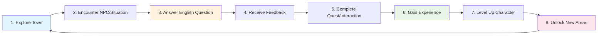

# Core Concept

## The Big Idea

**English Learning Town** is a 2D top-down RPG where players embark on a language learning journey disguised as an adventure game. Instead of fighting monsters with swords, players defeat challenges with correct English answers. Instead of collecting gold, they earn experience points through language mastery.

## Unique Selling Points

### 1. Seamless Integration

Unlike traditional educational games that feel like "vegetables disguised as dessert," our learning mechanics are the core gameplay loop. Answering questions isn't a mini-game interruption—it's how you interact with the world.

### 2. Persistent Character Growth

Your English skills directly translate to character abilities:

- **Vocabulary Level** → Unlocks new dialogue options with NPCs
- **Grammar Mastery** → Improves social interactions and quest rewards
- **Reading Comprehension** → Enables discovery of hidden secrets and lore
- **Listening Skills** → Better understanding of NPC audio cues

### 3. Contextual Learning

Questions aren't random—they're tied to the environment and story:

- Ordering food at the restaurant teaches food vocabulary
- Asking for directions practices location and movement phrases
- Shopping scenarios cover numbers, currency, and polite expressions
- Social interactions focus on conversation skills

## Core Gameplay Loop

## Player Journey

### Beginner (Levels 1-10)

- **Environment**: Starting village with basic shops and friendly NPCs
- **Questions**: Simple vocabulary, basic grammar, common phrases
- **Goals**: Learn navigation, understand game mechanics, build confidence

### Intermediate (Levels 11-25)

- **Environment**: Expanded town with school, library, and community center
- **Questions**: Complex sentences, tense usage, reading comprehension
- **Goals**: Develop conversational skills, tackle longer texts, social interactions

### Advanced (Levels 26+)

- **Environment**: Full city access including business district and cultural areas
- **Questions**: Nuanced grammar, idioms, advanced vocabulary, literature
- **Goals**: Master sophisticated language use, mentor other players, create content

## Emotional Design

### Feelings We Want to Create

- **Curiosity**: "What's behind that locked door?"
- **Accomplishment**: "I understood that entire conversation!"
- **Progression**: "I'm getting better at this!"
- **Connection**: "I want to help this NPC with their problem"
- **Discovery**: "I found a secret area!"

### Avoiding Negative Feelings

- **Frustration**: Adaptive difficulty prevents overwhelming challenges
- **Boredom**: Varied question types and engaging storylines
- **Isolation**: Social features and community elements
- **Failure**: Constructive feedback and multiple attempt opportunities

## Innovation Areas

### AI-Powered Conversations

Future versions could include natural language processing to allow free-form conversations with NPCs, making the experience even more immersive and practical.

### User-Generated Content

Players could create their own quests and questions, building a community-driven learning ecosystem.

### Real-World Integration

AR features could extend learning into the player's real environment, practicing English with virtual NPCs in real locations.
