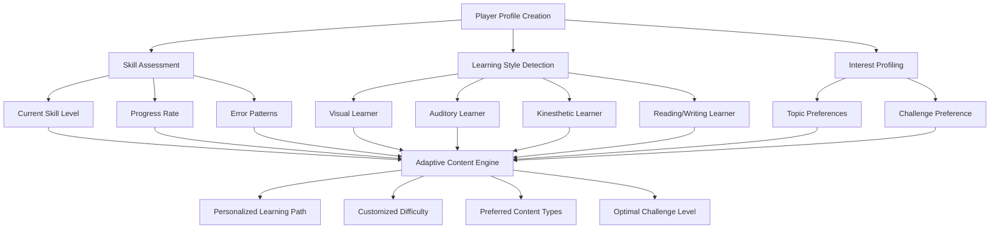
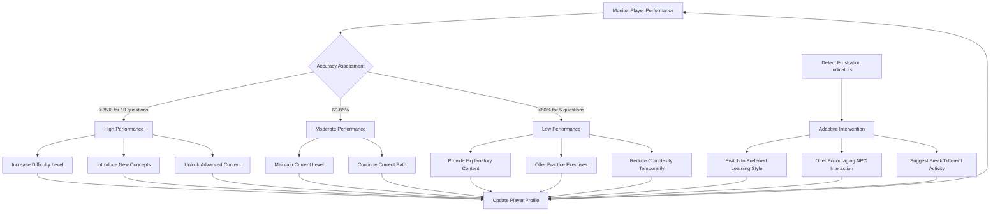
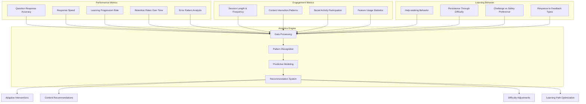

# Learning System

## Educational Philosophy

### Constructivist Learning
Players build knowledge through active engagement and discovery rather than passive consumption. The game provides scaffolded experiences where players construct understanding through meaningful interactions.

### Situated Learning
Language skills are developed within authentic contexts rather than isolated exercises. Every interaction takes place within realistic scenarios that mirror real-world English usage.

### Social Learning
Players learn from each other through collaboration, peer teaching, and community interaction, reflecting how language naturally develops through social engagement.

## Adaptive Learning Engine

### Personalization Algorithm

### Content Delivery Optimization
- **Spaced Repetition**: Concepts reappear at scientifically optimal intervals
- **Interleaving**: Mix different topics to improve retention and transfer
- **Progressive Difficulty**: Gradual increase in complexity based on mastery
- **Contextual Variation**: Same concepts presented in different scenarios

### Real-time Adaptation

## Curriculum Structure

### Foundation Level (Beginner)
**Target Proficiency**: A1-A2 CEFR

#### Core Topics
- **Basic Vocabulary**: Numbers, colors, family, food, time
- **Essential Grammar**: Present tense, articles, basic questions
- **Survival Phrases**: Greetings, directions, shopping basics
- **Cultural Basics**: Politeness, basic social norms

#### Learning Objectives
- Communicate basic needs and information
- Understand simple, familiar phrases
- Interact in basic social situations
- Build confidence in English usage

### Intermediate Level (Developing)
**Target Proficiency**: B1-B2 CEFR

#### Core Topics
- **Expanded Vocabulary**: Academic, professional, abstract concepts
- **Complex Grammar**: Past/future tenses, conditionals, passive voice
- **Conversation Skills**: Expressing opinions, describing experiences
- **Cultural Nuances**: Humor, indirect communication, regional differences

#### Learning Objectives
- Engage in extended conversations
- Understand main ideas in complex text
- Express ideas clearly and in detail
- Navigate cultural subtleties

### Advanced Level (Proficient)
**Target Proficiency**: C1-C2 CEFR

#### Core Topics
- **Sophisticated Vocabulary**: Idioms, technical terms, literary language
- **Advanced Grammar**: Subtle tense distinctions, complex structures
- **Nuanced Communication**: Persuasion, negotiation, academic discourse
- **Cultural Mastery**: Literature, history, contemporary issues

#### Learning Objectives
- Communicate with native-like fluency
- Understand implicit meaning and subtext
- Use language flexibly for academic/professional purposes
- Appreciate cultural and literary references

## Assessment Strategies

### Formative Assessment (Ongoing)
- **Real-time Performance**: Immediate feedback on every interaction
- **Error Analysis**: Pattern recognition to identify learning gaps
- **Self-reflection**: Player journals and goal-setting activities
- **Peer Assessment**: Community-based feedback and collaboration

### Summative Assessment (Milestone)
- **Level Examinations**: Comprehensive tests for advancement
- **Portfolio Development**: Collection of player's best work
- **Practical Demonstrations**: Real-world task simulations
- **Cultural Competency**: Understanding of social and cultural contexts

### Diagnostic Assessment (Placement)
- **Initial Placement**: Determine starting level and focus areas
- **Learning Style Identification**: Optimize content delivery method
- **Interest Profiling**: Customize content to player preferences
- **Goal Setting**: Establish personalized learning objectives

## Motivation and Engagement

### Flow State Design
- **Clear Goals**: Every activity has obvious objectives
- **Immediate Feedback**: Constant information about progress
- **Challenge-Skill Balance**: Difficulty matches player ability
- **Sense of Control**: Players direct their learning journey

### Gamification Elements

#### Points and Progression
- **Experience Points**: Quantified learning progress
- **Skill Progression**: Visual advancement in specific areas
- **Achievement Unlocks**: Recognition for reaching milestones
- **Mastery Indicators**: Clear evidence of competency development

#### Social Engagement
- **Leaderboards**: Friendly competition with peers
- **Collaborative Quests**: Group challenges requiring teamwork
- **Mentorship System**: Advanced players guide beginners
- **Community Events**: Special activities that unite players

#### Narrative Engagement
- **Personal Story**: Player's journey toward fluency goal
- **Character Development**: NPCs with evolving relationships
- **World Building**: Rich environment that rewards exploration
- **Mystery Elements**: Hidden content unlocked through learning

## Learning Analytics

### Data Collection

### Adaptive Interventions
- **Struggling Learners**: Additional scaffolding and support
- **Advanced Learners**: Enrichment activities and leadership roles
- **Disengaged Players**: Re-engagement strategies and content variety
- **Plateaued Progress**: New challenges and perspective shifts

### Success Indicators
- **Accuracy Improvement**: Steady increase in correct responses
- **Complexity Handling**: Ability to tackle more difficult content
- **Transfer Evidence**: Application of skills to new contexts
- **Confidence Growth**: Willingness to attempt challenging tasks
- **Real-world Application**: Use of English outside the game environment

## Research and Development

### Continuous Improvement
- **A/B Testing**: Compare effectiveness of different approaches
- **Player Feedback**: Regular surveys and focus groups
- **Academic Partnerships**: Collaboration with language learning researchers
- **Data-Driven Decisions**: Use analytics to guide content development

### Innovation Areas
- **AI Conversation Partners**: Natural language processing for free-form dialogue
- **Voice Recognition**: Speaking practice with pronunciation feedback
- **Virtual Reality**: Immersive environments for authentic practice
- **Cross-platform Learning**: Seamless experience across devices and contexts