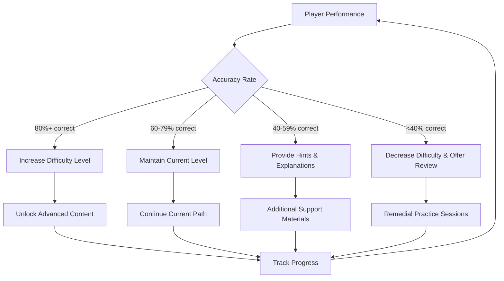
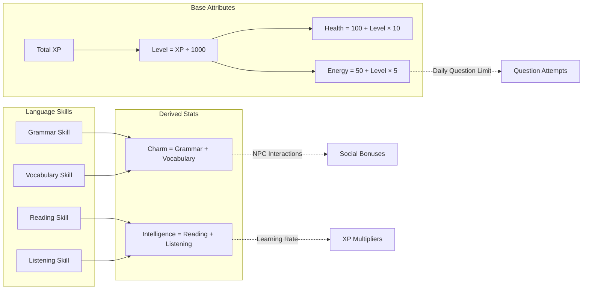

# Gameplay Mechanics

## Question System

### Question Types

#### Multiple Choice

- **Format**: Question with 4 possible answers (A, B, C, D)
- **Use Cases**: Vocabulary, grammar rules, reading comprehension
- **Scoring**: Immediate feedback with explanation for correct/incorrect answers

#### Fill in the Blank

- **Format**: Sentence with missing word(s)
- **Use Cases**: Grammar practice, vocabulary in context
- **Scoring**: Exact match or synonym recognition

#### Dialogue Selection

- **Format**: Conversation with NPCs requiring appropriate responses
- **Use Cases**: Social situations, cultural context, pragmatics
- **Scoring**: Context-appropriate answers, not just grammatically correct

#### Audio Comprehension

- **Format**: Listen to dialogue and answer questions
- **Use Cases**: Pronunciation, listening skills, accent familiarity
- **Scoring**: Understanding over perfect transcription

### Adaptive Difficulty

### Question Categories

1. **Grammar Fundamentals**
   - Tenses, articles, prepositions
   - Sentence structure, punctuation
   - Common grammatical patterns

2. **Vocabulary Building**
   - Common words by frequency
   - Topic-specific terminology
   - Idioms and expressions

3. **Reading Comprehension**
   - Short passages with questions
   - Context clue usage
   - Inference and analysis

4. **Practical Communication**
   - Restaurant ordering, shopping
   - Asking for help, giving directions
   - Phone conversations, email writing

## Character Progression

### Experience Points (XP)

- **Correct Answer**: Base XP = Question difficulty × 10
- **First Attempt**: +50% bonus
- **Streak Bonus**: +10% per consecutive correct answer (max 100%)
- **Daily Goal**: +200 XP for completing daily question quota

### Skill Trees

#### Language Skills

- **Vocabulary**: Unlocks advanced word recognition and usage
- **Grammar**: Enables complex sentence construction
- **Listening**: Improves audio question performance
- **Speaking**: Unlocks voice-based interactions (future feature)

#### Social Skills

- **Charisma**: Better NPC relationships and quest rewards
- **Cultural Awareness**: Access to cultural context explanations
- **Teaching**: Ability to help other players (mentorship system)

### Character Attributes

## Town Interaction System

### NPC Dialogue Trees

- **Branching Conversations**: Player choices affect dialogue progression
- **Skill Checks**: Higher language skills unlock additional dialogue options
- **Reputation System**: NPC relationships improve with successful interactions

### Building Interactions

#### Library

- **Research Quests**: Answer questions to unlock lore and backstory
- **Reading Challenges**: Comprehension passages with increasing difficulty
- **Study Groups**: Multiplayer collaborative learning sessions

#### School

- **Formal Lessons**: Structured grammar and vocabulary tutorials
- **Examinations**: Timed tests for significant XP rewards
- **Peer Tutoring**: Help lower-level players for mutual benefits

#### Marketplace

- **Shopping Simulations**: Practice numbers, currency, negotiation
- **Job Opportunities**: Work part-time jobs that require specific language skills
- **Cultural Exchange**: Learn about different English-speaking cultures

### Quest System

#### Main Story Quests

- **Narrative Arc**: Becoming fluent enough to achieve a major goal (job interview, university admission, etc.)
- **Chapter Structure**: Each chapter focuses on specific language skills
- **Character Development**: Personal growth mirrors language learning journey

#### Side Quests

- **NPC Problems**: Help townspeople with language-related challenges
- **Exploration**: Discover hidden areas by solving language puzzles
- **Collection**: Gather vocabulary words, grammar rules, or cultural facts

#### Daily Quests

- **Streak Maintenance**: Complete daily question quotas
- **Skill Focus**: Target specific weak areas identified by the system
- **Social Challenges**: Interact with other players or NPCs

## Reward Systems

### Immediate Rewards

- **XP and Currency**: Instant gratification for correct answers
- **Visual Feedback**: Particle effects, sound cues, and animations
- **Progress Bars**: Clear visualization of advancement

### Long-term Rewards

- **Unlockable Content**: New areas, NPCs, and storylines
- **Cosmetic Items**: Character customization options
- **Achievement Badges**: Recognition for specific accomplishments

### Social Rewards

- **Leaderboards**: Weekly and monthly rankings
- **Mentorship Opportunities**: Advanced players can guide beginners
- **Community Recognition**: Spotlight exceptional learners

## Failure and Support Mechanics

### Error Handling

- **Constructive Feedback**: Explanation of why an answer is incorrect
- **Hint System**: Progressive clues for struggling players
- **Review Mode**: Revisit missed questions with additional context

### Learning Support

- **Spaced Repetition**: Difficult concepts reappear at optimal intervals
- **Weakness Detection**: System identifies and targets problem areas
- **Adaptive Pacing**: Slower progression for players who need more time

### Motivation Maintenance

- **Comeback Mechanics**: Extra rewards for returning after breaks
- **Alternative Paths**: Multiple ways to progress for different learning styles
- **Celebration Moments**: Special recognition for breakthrough achievements
