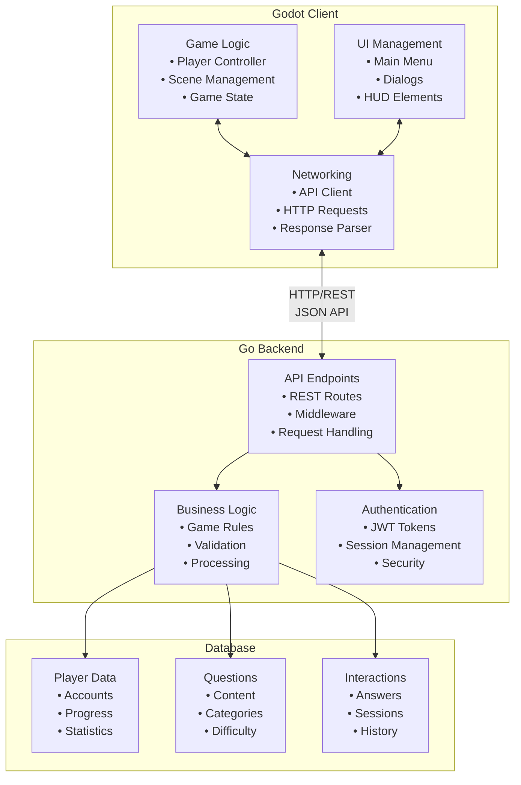

# Technical Architecture

This section provides comprehensive technical documentation for English Learning Town, covering system design, implementation details, and development guidelines.

## Technology Stack

### Backend (Go)
- **Language**: Go 1.21+
- **Framework**: Standard library with Gin web framework
- **Database**: SQLite for development, PostgreSQL for production
- **API Design**: RESTful architecture with JSON responses
- **Authentication**: JWT-based session management

### Frontend (Godot)
- **Engine**: Godot 4.x
- **Language**: GDScript
- **Platform**: Cross-platform (Windows, macOS, Linux, Web)
- **Networking**: HTTP client for API communication
- **UI Framework**: Godot's built-in UI system

### Infrastructure
- **Deployment**: Docker containers with Docker Compose
- **Database**: Containerized database with persistent volumes
- **Monitoring**: Application logging and health checks
- **CI/CD**: GitHub Actions for automated testing and deployment

## Architecture Overview

## Design Principles

### Scalability
- Stateless backend design for horizontal scaling
- Database optimization for high-concurrency reads
- Caching strategies for frequently accessed data
- Asynchronous processing for non-critical operations

### Security
- Input validation and sanitization
- SQL injection prevention through parameterized queries
- Rate limiting on API endpoints
- Secure session management with JWT tokens

### Maintainability
- Clear separation of concerns between layers
- Comprehensive error handling and logging
- Automated testing with good coverage
- Documentation-driven development

### Performance
- Efficient database queries with proper indexing
- Minimal network requests through batching
- Client-side caching of static content
- Optimized asset loading in Godot client

## Development Workflow

### Version Control
- Git-based workflow with feature branches
- Pull request reviews for all changes
- Automated testing before merge
- Semantic versioning for releases

### Testing Strategy
- Unit tests for business logic
- Integration tests for API endpoints
- End-to-end tests for critical user flows
- Performance testing for scalability validation

### Deployment Pipeline
1. **Development**: Local development with hot reload
2. **Testing**: Automated test suite execution
3. **Staging**: Production-like environment for validation
4. **Production**: Zero-downtime deployment with rollback capability