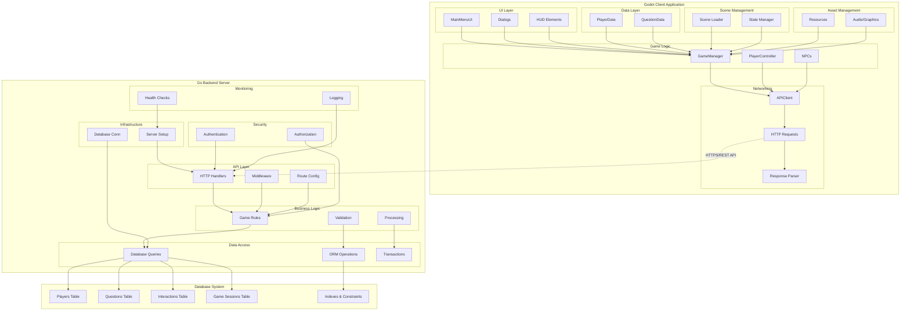

# System Overview

## High-Level Architecture

English Learning Town follows a client-server architecture with clear separation between the game client (Godot) and the backend services (Go). This design enables scalability, maintainability, and cross-platform compatibility.

### Component Diagram

## Data Flow

### Player Authentication Flow
1. **Client**: Player enters credentials in MainMenuUI
2. **Client**: APIClient sends authentication request to backend
3. **Backend**: Validates credentials against database
4. **Backend**: Generates JWT token and returns player data
5. **Client**: GameManager stores token and updates game state
6. **Client**: UI transitions to main game interface

### Question Interaction Flow
1. **Client**: Player encounters NPC or interactive element
2. **Client**: APIClient requests question from backend with difficulty/category
3. **Backend**: Selects appropriate question based on player profile
4. **Backend**: Returns question data to client
5. **Client**: UI displays question to player
6. **Client**: Player submits answer through UI
7. **Client**: APIClient sends answer to backend for validation
8. **Backend**: Processes answer, updates player stats, calculates rewards
9. **Backend**: Returns result with feedback and updated player data
10. **Client**: GameManager updates local state and displays feedback

### Progress Synchronization Flow
1. **Background**: Client periodically syncs progress with backend
2. **Client**: APIClient sends batch updates of local changes
3. **Backend**: Validates and processes updates
4. **Backend**: Returns consolidated player state
5. **Client**: Resolves any conflicts and updates local data

## Technology Decisions

### Why Go for Backend?
- **Performance**: Excellent concurrency support for handling multiple players
- **Simplicity**: Clean, readable code that's easy to maintain
- **Standard Library**: Robust HTTP server and JSON handling built-in
- **Deployment**: Single binary deployment with minimal dependencies
- **Scalability**: Efficient resource usage and horizontal scaling capability

### Why Godot for Client?
- **Cross-Platform**: Single codebase deploys to desktop, mobile, and web
- **2D Focus**: Optimized for 2D game development with excellent tools
- **GDScript**: Python-like scripting language easy for rapid development
- **Open Source**: No licensing fees and active community support
- **Performance**: Efficient rendering and resource management

### Why SQLite/PostgreSQL?
- **SQLite**: Perfect for development with zero configuration
- **PostgreSQL**: Production-ready with advanced features and reliability
- **SQL**: Well-understood query language with extensive ecosystem
- **ACID**: Transaction safety for critical game data
- **Performance**: Excellent read performance for question databases

## Service Boundaries

### Client Responsibilities
- **User Interface**: All visual presentation and user interaction
- **Game Logic**: Local game state management and validation
- **Caching**: Store frequently accessed data locally
- **Input Handling**: Process player actions and translate to API calls
- **Asset Management**: Load and manage game resources efficiently

### Backend Responsibilities
- **Data Persistence**: Authoritative storage of all persistent data
- **Business Rules**: Enforce game rules and learning algorithms
- **Authentication**: Secure player identity and session management
- **Question Selection**: Adaptive difficulty and content recommendation
- **Statistics**: Track and analyze player progress and performance

### Database Responsibilities
- **Data Integrity**: Ensure consistency through constraints and transactions
- **Performance**: Optimized queries through proper indexing
- **Backup**: Regular snapshots for disaster recovery
- **Scalability**: Handle growing data volume and concurrent access

## Communication Protocols

### API Design
- **RESTful**: Resource-based URLs with HTTP verbs
- **JSON**: Structured data exchange format
- **HTTP Status Codes**: Semantic response indication
- **Versioning**: API version in URL path for backward compatibility
- **Documentation**: OpenAPI/Swagger specification

### Error Handling
- **Client Errors (4xx)**: Invalid requests, authentication failures
- **Server Errors (5xx)**: Backend failures, database issues
- **Network Errors**: Connection timeouts, unreachable server
- **Graceful Degradation**: Offline mode for temporary disconnections

### Security Measures
- **HTTPS**: Encrypted communication between client and server
- **JWT Tokens**: Stateless authentication with expiration
- **Rate Limiting**: Prevent abuse and ensure fair resource usage
- **Input Validation**: Sanitize all user input on both client and server
- **SQL Injection Prevention**: Parameterized queries and ORM usage

## Performance Considerations

### Backend Optimization
- **Connection Pooling**: Reuse database connections for efficiency
- **Query Optimization**: Analyze and optimize slow queries
- **Caching**: Redis or in-memory cache for frequently accessed data
- **Indexing**: Strategic database indexes for common query patterns

### Client Optimization
- **Asset Streaming**: Load resources on-demand to reduce startup time
- **Memory Management**: Proper cleanup of unused resources
- **Network Batching**: Combine multiple API calls when possible
- **Local Caching**: Store static content locally with cache invalidation

### Database Optimization
- **Indexing Strategy**: Cover common query patterns without over-indexing
- **Query Analysis**: Use EXPLAIN PLAN to optimize expensive operations
- **Partitioning**: Separate large tables for improved performance
- **Read Replicas**: Scale read operations across multiple database instances