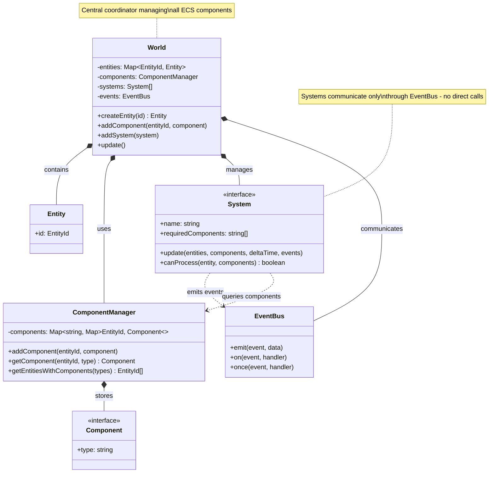
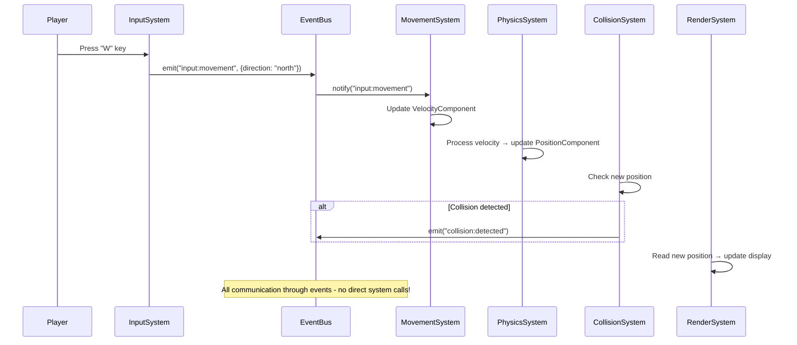
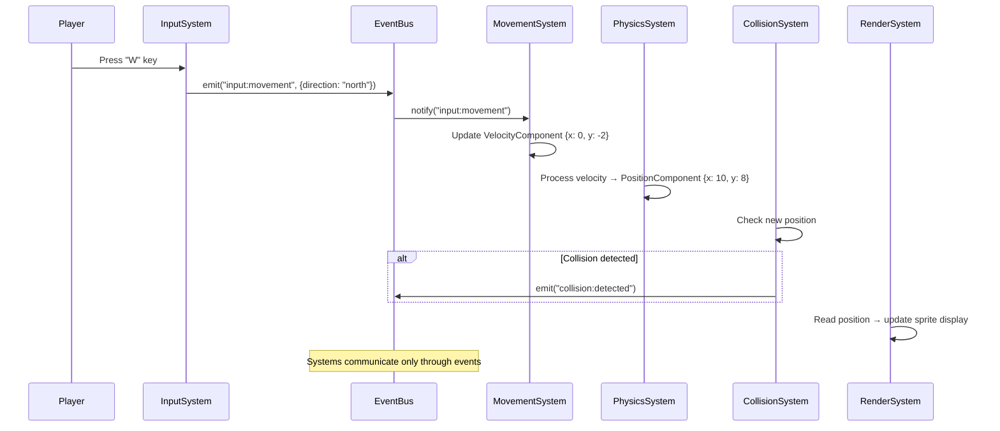
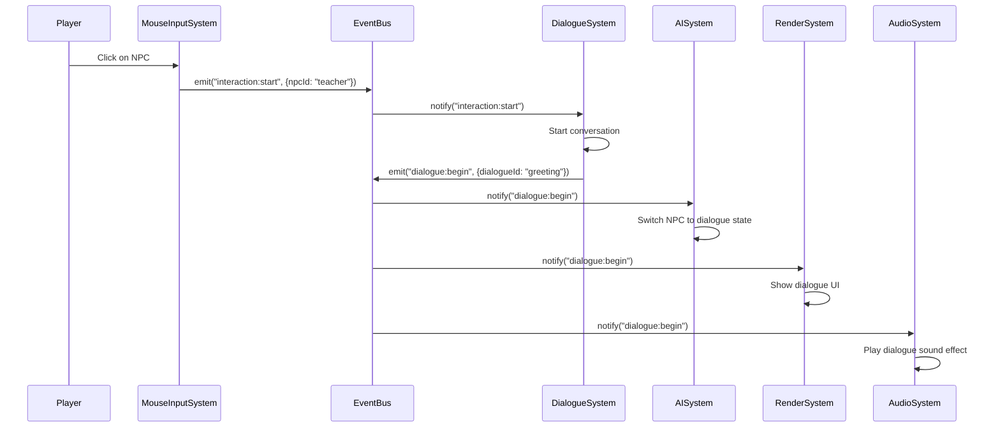
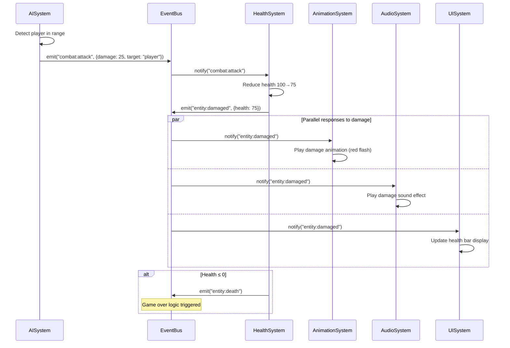

# @elt/core

Core Entity Component System (ECS) engine for English Learning Town.

## Overview

Pure TypeScript ECS implementation following **Single Responsibility Principle (SRP)** with modular architecture. Provides the foundation for game logic through composition-based design with event-driven communication.

## Features

- **Modular SRP Architecture**: Clean separation of concerns across focused modules
- **ECS Pattern**: World contains Entities (with Components) processed by Systems
- **Event-Driven**: Type-safe event bus for loose system coupling
- **Performance Optimized**: Entity pooling, component caching, spatial indexing
- **Tree-Shakeable**: Import only what you need for optimal bundle size
- **Fully Tested**: 157 comprehensive unit tests
- **Type-Safe**: Strict TypeScript with zero compilation errors

## Installation

```bash
pnpm add @elt/core
```

## Quick Start

```typescript
import {
  World,
  createPositionComponent,
  createRenderableComponent,
} from "@elt/core";

// Create ECS world
const world = new World();

// Create entity with components
const entity = world.createEntity("player");
world.addComponent(entity.id, createPositionComponent(10, 10));
world.addComponent(
  entity.id,
  createRenderableComponent("emoji", { icon: "🧑" }),
);

// Add systems
world.addSystem(new MovementSystem());
world.addSystem(new RenderSystem());

// Start game loop
const gameLoop = () => {
  world.update();
  requestAnimationFrame(gameLoop);
};
gameLoop();
```

## 🎯 ECS Basic Concepts

Before diving into the architecture, let's understand the core ECS concepts:

### What is an Entity?

An **Entity** is just a **unique ID** - nothing more! Think of it as a name tag or barcode for a game object.

```typescript
// Entities are just string IDs
const playerId = "player-alex";
const npcId = "teacher-mr-smith";
const buildingId = "school-main";

// An entity by itself has no data or behavior - it's just an identifier
```

**Real-world analogy**: Like a person's social security number - it identifies them, but doesn't contain their address, age, or skills.

### What is a Component?

A **Component** is **pure data** attached to an entity. Components have no logic - they're just data containers.

```typescript
// Components are pure data structures
interface PositionComponent {
  type: "position";
  x: number; // Where the entity is
  y: number;
}

interface HealthComponent {
  type: "health";
  current: number; // Current health points
  max: number; // Maximum health points
}

interface NPCComponent {
  type: "npc";
  name: string; // "Mr. Smith"
  role: string; // "Teacher"
}

// Example: Teacher NPC has these components attached
// Entity "teacher-mr-smith" has:
// - PositionComponent { x: 5, y: 3 }
// - HealthComponent { current: 100, max: 100 }
// - NPCComponent { name: "Mr. Smith", role: "Teacher" }
```

**Real-world analogy**: Like attributes on a person's profile - their location, health status, job title. The person (entity) has these attributes (components), but the attributes don't do anything by themselves.

### What is a System?

A **System** contains **all the logic**. Systems find entities with specific components and process them.

```typescript
// Systems contain logic and operate on entities with required components
class MovementSystem {
  requiredComponents = ["position", "velocity"]; // I need these components

  update() {
    // Find all entities that have BOTH position AND velocity components
    const movingEntities = world.getEntitiesWithComponents([
      "position",
      "velocity",
    ]);

    for (const entityId of movingEntities) {
      const position = world.getComponent(entityId, "position");
      const velocity = world.getComponent(entityId, "velocity");

      // Apply the logic: move the entity
      position.x += velocity.x;
      position.y += velocity.y;
    }
  }
}
```

**Real-world analogy**: Like a teacher who works with all students (entities) who have both "enrolled" and "present" status (components). The teacher (system) applies lessons (logic) to qualifying students.

### What is the World?

The **World** is the **central coordinator** that manages everything. It's like a database + orchestrator.

```typescript
// World manages the entire ECS ecosystem
const world = new World();

// 1. Create entities (just IDs)
const player = world.createEntity("player");
const teacher = world.createEntity("teacher");

// 2. Attach components (data) to entities
world.addComponent(player.id, { type: "position", x: 10, y: 10 });
world.addComponent(player.id, { type: "health", current: 100, max: 100 });

world.addComponent(teacher.id, { type: "position", x: 5, y: 3 });
world.addComponent(teacher.id, {
  type: "npc",
  name: "Mr. Smith",
  role: "Teacher",
});

// 3. Add systems (logic processors)
world.addSystem(new MovementSystem());
world.addSystem(new HealthSystem());
world.addSystem(new AISystem());

// 4. Run the game loop - systems process entities every frame
function gameLoop() {
  world.update(); // All systems process their relevant entities
  requestAnimationFrame(gameLoop);
}
```

**Real-world analogy**: Like a school administration system that manages student IDs, tracks their attributes (grades, attendance), and coordinates different departments (teachers/systems) who work with students.

### How They Work Together - Simple Example

```typescript
// 1. SETUP: Create a player entity
const player = world.createEntity("player");

// 2. COMPONENTS: Give the player data
world.addComponent(player.id, createPositionComponent(10, 10)); // Where they are
world.addComponent(player.id, createVelocityComponent(0, 0)); // How fast they move
world.addComponent(player.id, createHealthComponent(100, 100)); // Health points

// 3. SYSTEMS: Add logic processors
world.addSystem(new MovementSystem()); // Moves entities with position + velocity
world.addSystem(new HealthSystem()); // Handles entities with health
world.addSystem(new RenderSystem()); // Draws entities with position + renderable

// 4. GAME LOOP: Systems automatically find and process relevant entities
world.update();
// - MovementSystem finds player (has position + velocity) → moves them
// - HealthSystem finds player (has health) → applies regeneration
// - RenderSystem finds player (has position + renderable) → draws them
```

### 🎯 Key ECS Principles

1. **Entities = Identity**: Just unique IDs, no data or logic
2. **Components = Data**: Pure data containers, no logic
3. **Systems = Logic**: All behavior, operates on entities with specific components
4. **World = Coordinator**: Manages entities, components, and systems
5. **Composition**: Mix and match components to create any type of game object
6. **Separation**: Data (components) is completely separate from logic (systems)

This is the foundation of ECS - everything else builds on these core concepts!

## 🏗️ Modular Architecture

The core package follows **SRP (Single Responsibility Principle)** with clean modular organization:

### Core ECS Foundation (`core/`)

- **`types.ts`** - Entity, Component, System interfaces and type definitions
- **`componentManager.ts`** - Component data management, storage, and queries
- **`world.ts`** - ECS world coordination, entity lifecycle, system management
- **`index.ts`** - Unified exports for core ECS classes

### Component Modules (`components/`)

Components are organized by **domain responsibility**:

- **`spatial.ts`** - Position, size, velocity, collision (spatial relationships)
- **`visual.ts`** - Rendering, animation, visual presentation
- **`interaction.ts`** - User input, interactive elements, input handling
- **`game.ts`** - Player, NPC, building, furniture, decoration (game entities)
- **`enhanced.ts`** - Health, AI, physics, audio, timers (advanced gameplay)
- **`index.ts`** - Domain-organized component exports

### System Modules (`systems/`)

Systems are organized by **functional responsibility**:

- **`ai.ts`** - AISystem for NPC behavior, pathfinding, state machines
- **`audio.ts`** - AudioSystem for sound playback and audio management
- **`physics.ts`** - PhysicsSystem for advanced physics simulation
- **`utility.ts`** - TimerSystem, HealthSystem, StateMachineSystem (general utilities)
- **`index.ts`** - Functional system exports

### Utility Modules (`utils/`)

Utilities are organized by **specialized purpose**:

- **`performance.ts`** - EntityPool, ComponentCache, QueryManager (optimization)
- **`archetypes.ts`** - EntityArchetypes for predefined entity creation patterns
- **`spatial.ts`** - SpatialIndex for fast collision detection and queries
- **`math.ts`** - MathUtils for vector math, interpolation, calculations
- **`components.ts`** - ComponentUtils for component management and manipulation
- **`index.ts`** - Specialized utility exports

## 🧩 Component System

### Component Categories

#### Spatial Components

Position and movement in game world:

```typescript
import { createPositionComponent, createVelocityComponent } from "@elt/core";

const position = createPositionComponent(10, 5);
const velocity = createVelocityComponent(2, 0, 5); // x, y, maxSpeed
```

#### Visual Components

Rendering and animation:

```typescript
import { createRenderableComponent, createAnimationComponent } from "@elt/core";

const renderable = createRenderableComponent("emoji", {
  icon: "🧑",
  zIndex: 10,
});
const animation = createAnimationComponent("walk", {
  walk: { frames: ["🚶‍♂️", "🏃‍♂️"], duration: 500, loop: true },
});
```

#### Interactive Components

User interaction and input:

```typescript
import { createInteractiveComponent, createInputComponent } from "@elt/core";

const interactive = createInteractiveComponent("dialogue", {
  dialogueId: "greeting",
  requiresAdjacency: true,
});
const input = createInputComponent("player", true);
```

#### Game Components

Game-specific entities:

```typescript
import {
  createPlayerComponent,
  createNPCComponent,
  createBuildingComponent,
} from "@elt/core";

const player = createPlayerComponent("Alex");
const npc = createNPCComponent("Teacher", "educator");
const building = createBuildingComponent("School", "educational");
```

#### Enhanced Components

Advanced gameplay mechanics:

```typescript
import {
  createHealthComponent,
  createAIComponent,
  createPhysicsComponent,
} from "@elt/core";

const health = createHealthComponent(100, 100, 1); // current, max, regen
const ai = createAIComponent("patrol", 5, 2); // behavior, detection, speed
const physics = createPhysicsComponent(1, 0.5, 0.2, false); // mass, friction, bounce, static
```

## ⚙️ System Architecture

### Core Systems

#### AI System

Handles NPC behavior and pathfinding:

```typescript
import { AISystem } from "@elt/core";

const aiSystem = new AISystem();
world.addSystem(aiSystem);

// Supports: idle, patrol, chase, flee, guard, follow behaviors
```

#### Physics System

Advanced physics simulation:

```typescript
import { PhysicsSystem } from "@elt/core";

const physicsSystem = new PhysicsSystem();
world.addSystem(physicsSystem);

// Handles: gravity, forces, damping, collision response
```

#### Audio System

Sound playback and management:

```typescript
import { AudioSystem } from "@elt/core";

const audioSystem = new AudioSystem();
world.addSystem(audioSystem);

// Manages: sound effects, background music, spatial audio
```

#### Utility Systems

General-purpose systems:

```typescript
import { TimerSystem, HealthSystem, StateMachineSystem } from "@elt/core";

world.addSystem(new TimerSystem()); // Timer events and countdowns
world.addSystem(new HealthSystem()); // Health, damage, regeneration
world.addSystem(new StateMachineSystem()); // State transitions
```

## 🔄 System Collaboration Patterns

### Event-Driven Communication

Systems communicate through **events** rather than direct method calls for loose coupling:

```typescript
import { ecsEventBus } from "@elt/core";

// System A emits an event
ecsEventBus.emit("player:moved", {
  entityId: "player",
  position: { x: 10, y: 5 },
});

// System B listens and responds
ecsEventBus.on("player:moved", (event) => {
  // Update spatial index, check collisions, trigger interactions
});
```

### Component Query System

Systems discover entities through **component queries**:

```typescript
export class MovementSystem implements System {
  readonly requiredComponents = ["position", "velocity"] as const;

  update(entities: Entity[], components: ComponentManager, deltaTime: number) {
    // Automatically get entities with position AND velocity
    const movingEntities = components.getEntitiesWithComponents(
      this.requiredComponents,
    );

    for (const entityId of movingEntities) {
      const position = components.getComponent<PositionComponent>(
        entityId,
        "position",
      );
      const velocity = components.getComponent<VelocityComponent>(
        entityId,
        "velocity",
      );
      // Update position based on velocity
    }
  }
}
```

### ECS Architecture Structure



#### Real Example Flow - Player Movement:



### System Collaboration Examples

#### 🎮 Player Movement



#### 💬 NPC Dialogue Interaction



#### ⚔️ Combat Damage System



#### 🏃 Why Event-Driven Architecture Works

- **No Direct Dependencies**: Systems never call each other directly
- **Easy to Add Features**: Want damage numbers? Just listen to "entity:damaged" events
- **Easy to Debug**: Log all events to see exactly what happened
- **Easy to Test**: Mock events to test individual systems
- **Scalable**: Add new systems without changing existing code

## 🚀 Performance Utilities

### Entity Pooling

Reuse entity IDs for performance:

```typescript
import { EntityPool } from "@elt/core";

const pool = new EntityPool();
const entityId = pool.getEntityId(); // Reuses existing IDs when possible
// ... use entity
pool.releaseEntityId(entityId); // Return to pool
```

### Component Caching

Cache frequently accessed components:

```typescript
import { ComponentCache } from "@elt/core";

const cache = new ComponentCache(1000); // LRU cache with 1000 items
const position = cache.get<PositionComponent>("player", "position");
```

### Spatial Indexing

Fast spatial queries for collision detection:

```typescript
import { SpatialIndex } from "@elt/core";

const spatialIndex = new SpatialIndex(5); // 5x5 grid cells
spatialIndex.addEntity("player", 10, 10);
const nearby = spatialIndex.getNearbyEntities(10, 10, 2); // Within radius 2
```

### Entity Archetypes

Predefined entity creation patterns:

```typescript
import { EntityArchetypes } from "@elt/core";

// Creates entity with all required components for a player
const player = EntityArchetypes.createPlayer(
  world,
  "player",
  { x: 10, y: 10 },
  "Alex",
);

// Creates fully configured NPC with AI, dialogue, health
const npc = EntityArchetypes.createNPC(
  world,
  "teacher",
  { x: 5, y: 3 },
  "Teacher",
  "educator",
);
```

## 📊 Event System

Type-safe event bus for system communication with zero coupling:

```typescript
import { ecsEventBus, ECSEventTypes } from "@elt/core";

// Built-in ECS events
ecsEventBus.emit(ECSEventTypes.ENTITY_ADDED, { entityId: "player" });
ecsEventBus.emit(ECSEventTypes.COMPONENT_ADDED, {
  entityId: "player",
  componentType: "position",
});

// Custom game events
ecsEventBus.emit("dialogue:start", { npcId: "teacher", playerId: "player" });
ecsEventBus.emit("scene:transition", { from: "town", to: "school-interior" });
ecsEventBus.emit("player:moved", {
  entityId: "player",
  position: { x: 10, y: 5 },
});

// Event listeners
ecsEventBus.on("dialogue:start", (event) => {
  console.log(`Starting dialogue with ${event.npcId}`);
});

// One-time listeners
ecsEventBus.once("scene:transition", (event) => {
  console.log(`Scene changed from ${event.from} to ${event.to}`);
});
```

### Event-Driven Benefits

- **Loose Coupling**: Systems don't directly reference each other
- **Scalability**: Add new systems without modifying existing ones
- **Testability**: Mock events for isolated system testing
- **Debugging**: Central event log for tracing system interactions

## 🔧 Advanced Usage

### Tree-Shaking Imports

Import only what you need for optimal bundle size:

```typescript
// Import specific modules for better tree-shaking
import { World } from "@elt/core/core";
import { createPositionComponent } from "@elt/core/components/spatial";
import { AISystem } from "@elt/core/systems/ai";
import { EntityPool } from "@elt/core/utils/performance";
```

### Custom Component Development

Create domain-specific components:

```typescript
import type { Component } from "@elt/core";

interface WeaponComponent extends Component {
  readonly type: "weapon";
  damage: number;
  range: number;
  ammo: number;
}

export const createWeaponComponent = (
  damage: number,
  range: number,
  ammo: number,
): WeaponComponent => ({
  type: "weapon",
  damage,
  range,
  ammo,
});
```

### Custom System Development

Create specialized systems:

```typescript
import type { System, Entity, ComponentManager } from "@elt/core";
import type { Emitter, ECSEvents } from "@elt/core";

export class CombatSystem implements System {
  readonly name = "CombatSystem";
  readonly requiredComponents = ["position", "health", "weapon"] as const;

  update(
    entities: Entity[],
    components: ComponentManager,
    deltaTime: number,
    events: Emitter<ECSEvents>,
  ): void {
    const combatEntities = components.getEntitiesWithComponents(
      this.requiredComponents,
    );

    for (const entityId of combatEntities) {
      // Process combat logic
      const position = components.getComponent(entityId, "position");
      const health = components.getComponent(entityId, "health");
      const weapon = components.getComponent(entityId, "weapon");

      // Emit combat events
      events.emit("combat:attack", {
        attackerId: entityId,
        damage: weapon.damage,
      });
    }
  }

  canProcess(entity: Entity, components: ComponentManager): boolean {
    return components.hasAllComponents(entity.id, this.requiredComponents);
  }
}
```

## 📈 Performance Best Practices

1. **Use Entity Pooling** for frequently created/destroyed entities
2. **Cache Components** for entities accessed multiple times per frame
3. **Spatial Indexing** for collision detection with many entities
4. **Component Queries** instead of iterating all entities
5. **Event Batching** for multiple related events
6. **Tree-Shaking** imports to reduce bundle size

## 🧪 Development

```bash
# Install dependencies
pnpm install

# Run tests
pnpm test

# Run tests in watch mode
pnpm test --watch

# Build package
pnpm build

# Lint code
pnpm lint
```

## 🧪 Testing

Comprehensive test suite with **157 tests** covering:

- **Core ECS functionality** - World, ComponentManager, Entity lifecycle
- **Component creation** - All component factories and type safety
- **System processing** - AI, Physics, Audio, Utility systems
- **Event bus communication** - Type-safe event emission and listening
- **Integration scenarios** - Full game loop simulation
- **Performance utilities** - Entity pooling, caching, spatial indexing

### Test Structure

```
src/__tests__/
├── core.test.ts              # Core ECS classes (30 tests)
├── components.test.ts        # Component factories (47 tests)
├── enhanced-components.test.ts # Advanced components (24 tests)
├── systems.test.ts           # System implementations (25 tests)
├── events.test.ts            # Event bus functionality (20 tests)
└── integration.test.ts       # End-to-end scenarios (11 tests)
```

## 🏆 Architecture Benefits

### Single Responsibility Principle (SRP)

- **`core/`** - Pure ECS foundation
- **`components/`** - Domain-organized data containers
- **`systems/`** - Functionally-focused logic processors
- **`utils/`** - Specialized utility functions

### Composition over Inheritance

- **Flexible entity creation** - Mix and match components as needed
- **No rigid class hierarchies** - Entities are just component collections
- **Easy feature addition** - Add components without breaking existing entities

### Event-Driven Architecture

- **Loose coupling** - Systems communicate through events
- **Scalable design** - Add systems without modifying others
- **Debuggable** - Central event log for tracing interactions

### Performance Optimizations

- **Entity pooling** - Reuse entity IDs to reduce garbage collection
- **Component caching** - LRU cache for frequently accessed components
- **Spatial indexing** - Fast collision detection for large entity counts
- **Query optimization** - Efficient component filtering and batching

## 📝 License

Private - English Learning Town Project
