# Range-Based Architecture Design

## Overview

This document describes the Range-based architecture refactor for the English Learning Town grid system. The design implements a polymorphic approach where all entities in the grid are treated as uniform `Range` objects with specialized behaviors.

## Updated Class Diagram (2025-01-03)

**Focus on 4 Core Concerns: Boundary, Walkability, Interaction, Rendering**

```mermaid
classDiagram
    %% Abstract Range Base Class
    class Range {
        <<abstract>>
        -id: string
        -position: GridPosition
        -size: GridSize
        -renderingStrategy: RenderingStrategy
        
        %% CONCERN 1: Boundary
        +containsPosition(gridX, gridY): boolean
        +getScreenPosition(cellSize): Position
        +getScreenSize(cellSize): Size
        
        %% CONCERN 2: Walkability
        +isWalkableRange(): boolean
        +setWalkable(walkable): void
        
        %% CONCERN 3: Interaction
        +getInteractionPosition(): GridPosition
        +onInteraction(): void
        +canInteract(): boolean*
        
        %% CONCERN 4: Rendering (Strategy Pattern)
        +render(cellSize): ReactNode
        +setRenderingStrategy(strategy): void
        +getTypeName(): string*
    }

    %% Strategy Pattern for Rendering
    class RenderingStrategy {
        <<interface>>
        +render(props: RenderProps): ReactNode
    }

    class RenderProps {
        +screenX: number
        +screenY: number
        +screenWidth: number
        +screenHeight: number
        +onClick: Function
    }

    %% Concrete Rendering Strategies
    class EmojiStrategy {
        -emoji: string
        -backgroundColor?: string
        -borderColor?: string
        +render(props): ReactNode
    }

    class StaticImageStrategy {
        -imageUrl: string
        -alt: string
        +render(props): ReactNode
    }

    class AnimatedGifStrategy {
        -gifUrl: string
        -alt: string
        +render(props): ReactNode
    }

    class CSSAnimationStrategy {
        -content: ReactNode
        -animationClass: string
        -backgroundColor?: string
        +render(props): ReactNode
    }

    class SpriteSheetStrategy {
        -spriteSheetUrl: string
        -frameWidth: number
        -frameHeight: number
        -frameCount: number
        -animationSpeed: number
        +render(props): ReactNode
    }

    %% Enums and Constants
    class SpriteRole {
        <<enumeration>>
        PLAYER
        NPC
    }

    %% Concrete Range Classes
    class BuildingRange {
        -name: string
        -color: string
        -icon: string
        -onClickHandler: Function
        
        +canInteract(): boolean
        +getTypeName(): string
        +setClickHandler(handler): void
        +toLegacyBuilding(): object
        +fromLegacyBuilding(building): BuildingRange
    }

    class SpriteRange {
        -name: string
        -icon: string
        -role: SpriteRole
        -blocksMovement: boolean
        -onInteractionHandler: Function
        -isNearby: boolean
        
        +canInteract(): boolean
        +getTypeName(): string
        +setInteractionHandler(handler): void
        +updatePosition(newPosition): SpriteRange
        +setNearby(nearby): void
        +createPlayer(position): SpriteRange
        +createNPC(data): SpriteRange
    }

    class PlantRange {
        -icon: string
        -canWalkThrough: boolean
        -description: string
        
        +canInteract(): boolean
        +getTypeName(): string
        +canCollide(): boolean
        +createTree(id, position, size): PlantRange
        +createBush(id, position, size): PlantRange
        +createFlower(id, position, size): PlantRange
        +createGrass(id, position, size): PlantRange
    }

    %% Grid System Support
    class GridPosition {
        +x: number
        +y: number
    }

    class GridSize {
        +width: number
        +height: number
    }

    %% Factory Pattern
    class RangeFactory {
        <<utility>>
        +createBuilding(config): BuildingRange
        +createSchool(position): BuildingRange
        +createShop(position): BuildingRange
        +createLibrary(position): BuildingRange
        +createCafe(position): BuildingRange
        +createPlayer(position): SpriteRange
        +createNPC(data): SpriteRange
        +createRandomPlant(position): PlantRange
    }


    %% Relationships
    Range <|-- BuildingRange
    Range <|-- SpriteRange
    Range <|-- PlantRange
    
    Range *-- RenderingStrategy : composition
    Range *-- GridPosition : contains
    Range *-- GridSize : contains
    
    RenderingStrategy <|.. EmojiStrategy
    RenderingStrategy <|.. StaticImageStrategy
    RenderingStrategy <|.. AnimatedGifStrategy
    RenderingStrategy <|.. CSSAnimationStrategy
    RenderingStrategy <|.. SpriteSheetStrategy
    
    RenderingStrategy ..> RenderProps : uses
    
    SpriteRange *-- SpriteRole : uses

    RangeFactory ..> BuildingRange : creates
    RangeFactory ..> SpriteRange : creates
    RangeFactory ..> PlantRange : creates
```



## Design Patterns

### 1. Four Core Concerns Architecture

The `Range` abstract class is organized around exactly **4 essential concerns**:

```typescript
abstract class Range {
  // CONCERN 1: Boundary - position and size in grid space
  containsPosition(gridX: number, gridY: number): boolean
  getScreenPosition(cellSize: number): { x: number; y: number }
  
  // CONCERN 2: Walkability - can sprites pass through?
  isWalkableRange(): boolean
  setWalkable(walkable: boolean): void
  
  // CONCERN 3: Interaction - what happens when engaged?
  abstract canInteract(): boolean
  onInteraction(): void
  
  // CONCERN 4: Rendering - how does it visually appear?
  render(cellSize: number): ReactNode
  setRenderingStrategy(strategy: RenderingStrategy): void
}
```

### 2. Strategy Pattern for Rendering

Ranges use composition with rendering strategies for flexible visual representation:

```typescript
// Same Range can use different rendering strategies
const building = new BuildingRange({
  id: 'school',
  position: { x: 5, y: 3 },
  renderingStrategy: new EmojiStrategy('🏫', '#e17055')
});

// Switch to image rendering at runtime
building.setRenderingStrategy(
  new StaticImageStrategy('/assets/school.png')
);

// Or upgrade to animated sprite sheet
building.setRenderingStrategy(
  new SpriteSheetStrategy('/assets/school-anim.png', 64, 64, 8)
);
```

### 3. Simplified Polymorphism

All ranges are treated uniformly through their 4 core concerns:

```typescript
// Grid system works with any Range type through unified interface
ranges.forEach(range => {
  // Boundary concern
  const screenPos = range.getScreenPosition(cellSize);
  
  // Walkability concern  
  if (!range.isWalkableRange()) {
    gridSystem.markBlocked(range.position, range.size);
  }
  
  // Rendering concern
  mapContainer.appendChild(range.render(cellSize));
  
  // Interaction concern
  if (range.canInteract()) {
    range.onInteraction = () => handleInteraction(range);
  }
});
```

### 4. Composition Over Inheritance

No complex type hierarchies - just essential properties and behavior:

```typescript
// Building: Non-walkable, interactive
class BuildingRange extends Range {
  canInteract(): boolean { return true; }     // Can enter buildings
  isWalkableRange(): boolean { return false; } // Buildings block movement
}

// Plant: Configurable walkability, decorative
class PlantRange extends Range {
  canInteract(): boolean { return false; }     // Purely decorative
  isWalkableRange(): boolean { return this.canWalkThrough; } // Flowers=true, Trees=false
}

// Sprite: Role-based behavior
class SpriteRange extends Range {
  canInteract(): boolean { return this.role === 'NPC'; } // NPCs start dialogue
  isWalkableRange(): boolean { return !this.blocksMovement; } // Player=walkable, NPCs=blocked
}
```

### 5. Factory Pattern with Strategy Defaults

`RangeFactory` provides sensible rendering strategy defaults:

```typescript
class RangeFactory {
  // Predefined building with emoji strategy
  static createSchool(position: GridPosition): BuildingRange {
    return new BuildingRange({
      id: 'school',
      position,
      size: { width: 4, height: 3 },
      name: 'School',
      color: '#e17055',
      icon: '🏫',
      renderingStrategy: new EmojiStrategy('🏫', '#e17055') // Default strategy
    });
  }
  
  // Plant factory with walkability defaults
  static createTree(id: string, position: GridPosition): PlantRange {
    return new PlantRange({
      id,
      position,
      size: { width: 2, height: 2 },
      icon: '🌳',
      canWalkThrough: false, // Trees block movement
      description: 'A tall tree providing shade',
      renderingStrategy: new EmojiStrategy('🌳')
    });
  }
}
```

## Architecture Benefits

### 1. **Four Core Concerns Focus**
Every Range focuses on exactly 4 essential concerns:
- **Boundary**: Position and size in grid space
- **Walkability**: Simple collision detection logic
- **Interaction**: Clear interaction contracts
- **Rendering**: Strategy pattern for flexible visuals

### 2. **Strategy Pattern Flexibility** 
- Same Range can display as emoji, image, GIF, or animation
- Easy to swap rendering strategies at runtime
- Support for different asset types (emoji → image → sprite sheet)
- Artists can work independently on visual assets

### 3. **Simplified Architecture**
- No unnecessary type enums (removed `PlantType`)
- No complex inheritance hierarchies
- Each Range focuses on essential properties only
- Clean composition over inheritance

### 4. **Game Development Benefits**
- Easy to prototype with emojis, upgrade to real assets
- Programmers focus on game logic, not rendering details
- Supports different art styles for same game objects
- Modern TypeScript syntax with `private readonly` fields

### 5. **Clean Separation of Concerns**
- **Range Classes**: Handle the 4 core concerns only
- **Strategy Pattern**: Encapsulates all rendering complexity
- **Factory Pattern**: Provides sensible defaults
- **Type Safety**: Modern TypeScript patterns throughout

## File Structure

```
src/
├── types/
│   ├── ranges.ts                 # Base Range types and interfaces
│   └── renderingStrategies.tsx  # Strategy pattern for rendering
├── ranges/
│   ├── BuildingRange.tsx         # Building implementation
│   ├── SpriteRange.tsx          # NPC/Player implementation
│   ├── PlantRange.tsx           # Vegetation implementation (simplified)
│   ├── SimpleRange.ts           # Basic concrete implementations
│   └── RangeFactory.ts          # Factory utilities
├── utils/
│   └── gridSystem.ts            # Grid system (40px cells)
├── hooks/
│   ├── useGridSystem.ts         # React hook for grid
│   ├── useGameEntities.ts       # Entity management hook
│   └── usePlayerMovement.ts     # Player movement hook
└── components/game/
    ├── TownMap.tsx              # Map component
    ├── GridOverlay.tsx          # Visual grid debugging
    └── Player.tsx               # Player sprite component
```

## Usage Examples

### Creating Entities with Strategy Pattern

```typescript
// Using factory methods (provides default strategies)
const school = RangeFactory.createSchool({ x: 5, y: 3 });
const tree = PlantRange.createTree('tree1', { x: 2, y: 8 });
const npc = SpriteRange.createNPC({
  id: 'teacher',
  position: { x: 6, y: 7 },
  name: 'Teacher',
  icon: '👩‍🏫'
});

// Using constructors with custom strategies
const hospital = new BuildingRange({
  id: 'hospital',
  position: { x: 10, y: 15 },
  size: { width: 5, height: 4 },
  name: 'Hospital',
  color: '#ff6b6b',
  icon: '🏥',
  renderingStrategy: new StaticImageStrategy('/assets/hospital.png')
});
```

### Dynamic Rendering Strategy Changes

```typescript
// Start with emoji for rapid prototyping
const guard = new SpriteRange({
  id: 'guard',
  position: { x: 10, y: 10 },
  name: 'Guard',
  icon: '💂',
  role: SpriteRole.NPC,
  renderingStrategy: new EmojiStrategy('💂')
});

// Upgrade to animated GIF
guard.setRenderingStrategy(
  new AnimatedGifStrategy('/assets/guard-walking.gif')
);

// Finally upgrade to sprite sheet animation
guard.setRenderingStrategy(
  new SpriteSheetStrategy('/assets/guard-spritesheet.png', 32, 32, 8)
);
```

### React Integration with Modern Architecture

```typescript
function TownExploration() {
  const { buildings, npcs } = useGameEntities();
  const { playerPosition, movePlayer } = usePlayerMovement(buildings, npcs);
  
  return (
    <TownMap 
      playerPosition={playerPosition}
      buildings={buildings}
      npcs={npcs}
      onMapClick={movePlayer}  // Cell-by-cell movement
      showGrid={true}
    />
  );
}
```

## Key Insights and Simplifications (2025-01-03)

### ❌ Removed Unnecessary Complexity
- **PlantType enum**: Plants don't need type categorization - focus on walkability
- **Complex inheritance**: Simplified to focus on 4 core concerns only
- **Type-specific switch statements**: Eliminated with strategy pattern
- **Legacy React hooks**: Updated to modern patterns

### ✅ Achieved Core Architecture Goals
1. **Boundary, Walkability, Interaction, Rendering** - The 4 essential concerns
2. **Strategy Pattern** - Flexible rendering without changing game logic
3. **Modern TypeScript** - `private readonly` fields, clean abstractions
4. **Single Responsibility** - Each Range class has one clear purpose

### 🎯 Real-World Benefits
- **Rapid Prototyping**: Use emojis → upgrade to sprites seamlessly
- **Asset Pipeline**: Artists work independently from programmers  
- **Maintainable**: Changes isolated to specific concerns
- **Extensible**: Easy to add new Range types or rendering strategies

## Future Extensions

The simplified architecture easily supports future enhancements:

### 1. **New Rendering Strategies**
```typescript
class VideoStrategy implements RenderingStrategy {
  render(props: RenderProps): ReactNode {
    return <video src={this.videoUrl} autoPlay loop />;
  }
}
```

### 2. **Interactive Objects** 
```typescript
class InteractiveObject extends Range {
  canInteract(): boolean { return true; }
  onInteraction(): void { /* Trigger quest, pickup item, etc. */ }
  isWalkableRange(): boolean { return true; } // Can walk through
}
```

### 3. **Conditional Ranges**
```typescript
class ConditionalRange extends Range {
  constructor(private condition: () => boolean) { super(); }
  isWalkableRange(): boolean { return this.condition(); }
  canInteract(): boolean { return this.condition(); }
}
```

This simplified architecture provides a solid foundation for the English Learning Town grid system with **4 core concerns**, **strategy pattern rendering**, and **modern TypeScript patterns**.